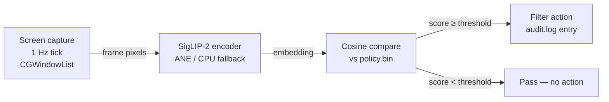
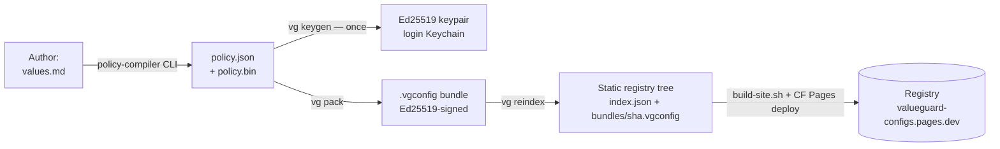
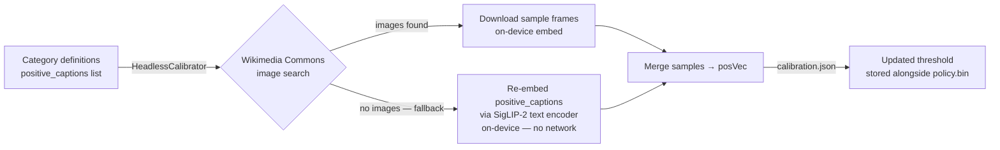

# ValueGuard process map — repo-local projection (valueguard)

> This is a **repo-local projection**, not the source of truth. It is maintained
> on PR branches by the `LSS Process Map` GitHub Action when a PR changes the
> project's *process* (a hand-off, gate, pipeline stage, deploy step, or data
> flow). The weekly LSS kaizen sweep reconciles this file **up** into the
> canonical wiki page; the wiki always wins on conflict.

**Authoritative: ~/wiki/valueguard-process-map.md**

This repo (`valueguard`) is a **Swift/macOS app + SPM daemon library**
(on-device content filtering; menubar app + marketplace registry). Do not
restate durable facts the wiki owns — reference them via `[[page]]` (e.g. the
marketplace prototype notes in `[[valueguard-marketplace-prototype]]`).

---

## Pipeline A — On-device content filter (steady-state)

**Key boundary (2026-06-08):** Screen capture switched from `SCShareableContent`
to `CGWindowListCopyWindowInfo` (PR #29, completing partial fix from PR #26).
This removes a TCC re-prompt on every daemon restart while preserving the same
window-metadata output. No IPC boundary change.

---

## Pipeline B — Marketplace authoring (config publisher)

See `[[valueguard-marketplace-prototype]]` for pack/sign/verify contract details.

---

## Pipeline C — One-click install (end-user, added 2026-06-01)

```mermaid
flowchart LR
    WEB[Web directory\nvalueguard-configs.pages.dev] -->|"Install in ValueGuard" button| URL["vgconfig://install\n?registry=&ref=author/slug"]
    URL -->|URL scheme open / cold-launch replay| APP[App:\nConfigInstallCoordinator]
    APP -->|resolve + HTTPS download + sha-check| DL[.vgconfig bundle]
    DL -->|BundleVerifier\nEd25519 verify| GATE{Trust-confirm sheet\n— author fingerprint\n— registry origin\n— verified badge}
    GATE -->|User approves| INST[Install to\n~/Library/.../ValueGuard/configs/]
    GATE -->|User cancels| ABORT[Abort — no files written]
    INST -->|Activate → copy-on-activate| COPY["policy.bin\n+ policy.json\n+ calibration.json\n→ flat install dir"]
    COPY -->|Daemon restart| SC

    SC[ScreenCapture loop\nresumes with new policy]

    %% DOWNTIME: Transportation — HTTPS fetch, sha-check, Ed25519 verify before install
    %% DOWNTIME: Waiting (REMOVED) — prior path required CLI; one-click eliminates terminal hand-off
    %% DOWNTIME: Motion (REMOVED) — no context-switch to terminal for end-user install
    %% DOWNTIME: Defects (FIXED PR #22) — activate guard previously blocked from .installed state → silent no-op
    %% DOWNTIME: Defects (FIXED PR #23) — copy-on-activate was missing policy.json + calibration.json sidecars
```

**Gate:** the trust-confirm sheet is a deliberate approval step (security, not
waste). It surfaces author key fingerprint, registry origin, categories, and
verified state before writing any files.

---

## Pipeline D — App auto-update (Sparkle, added 2026-06-01)

```mermaid
flowchart LR
    DEV[Developer:\nnew release DMG] -->|notarize + package-release.sh| SIGN[EdDSA-signed DMG\n+ updated appcast.xml]
    SIGN -->|build-site.sh deploy| CAST[appcast.xml\non CF Pages]
    CAST -->|Sparkle daily background check| SPK[Sparkle\nin running app]
    SPK -->|update available| DL2[Download + EdDSA verify]
    DL2 -->|install + relaunch| UPD[Updated app]

    %% DOWNTIME: Waiting (REMOVED) — users no longer need to notice/manually check releases
    %% DOWNTIME: Transportation — EdDSA sign at package time; verify at Sparkle install time
    %% NOTE: 0.2.0→0.3.0 jump is one-time manual install; Sparkle self-updates from 0.3.0 onward
```

The EdDSA private key lives only in the developer's login Keychain (never in
repo). `SUPublicEDKey` in `Info.plist` is the verification-side public key.

---

## Pipeline E — Calibration (filter tuning, updated 2026-06-01)

---

## DOWNTIME-waste ledger (week of 2026-06-01)

| Waste | Direction | Source |
|-------|-----------|--------|
| **Defects** | −3 removed | PR #22 (silent activate no-op), PR #23 (missing sidecar files on activate), PR #29 (spurious TCC re-prompt on Apply) |
| **Waiting** | −2 removed | PR #15 (no-CLI install), PR #17 (auto-update) |
| **Motion** | −1 removed | PR #15 (terminal context-switch eliminated for end-users) |
| **Transportation** | +2 added | PR #13 (HTTPS + sha-check + Ed25519 in registry install), PR #17 (EdDSA sign/verify in update pipeline) |
| **Extra-processing** | −1 removed | PR #26 (caption-anchor fallback avoids zero-sample calibration dead-end) |

Net: significant waste reduction; the two new Transportation steps are
load-bearing security gates, not avoidable overhead.

---

## Conventions

- **DOWNTIME tags** annotate each step with the waste it risks.
- **Next revision trigger**: any PR that adds/removes an app<->daemon IPC
  boundary, marketplace pack/sign/verify step, install/update step, signing
  config, or filter decision point.
- **See Also**: the canonical `[[valueguard-process-map]]`.
