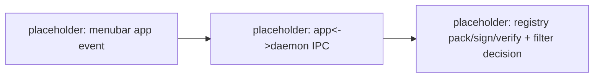

# ValueGuard process map — repo-local projection (valueguard)

> This is a **repo-local projection**, not the source of truth. It is maintained
> on PR branches by the `LSS Process Map` GitHub Action when a PR changes the
> project's *process* (a hand-off, gate, pipeline stage, deploy step, or data
> flow). The weekly LSS kaizen sweep reconciles this file **up** into the
> canonical wiki page; the wiki always wins on conflict.

**Authoritative: ~/wiki/valueguard-process-map.md**

This repo (`valueguard`) is a **Swift/macOS app + SPM daemon library**
(on-device content filtering; menubar app + marketplace registry). Do not
restate durable facts the wiki owns — reference them via `[[page]]` (e.g. the
marketplace prototype notes in `[[valueguard-marketplace-prototype]]`).

## Current map (placeholder — the Action will flesh this out)

## Conventions

- **DOWNTIME tags** annotate each step with the waste it risks.
- **Next revision trigger**: any PR that adds/removes an app<->daemon IPC
  boundary, marketplace pack/sign/verify step, install/update step, signing
  config, or filter decision point.
- **See Also**: the canonical `[[valueguard-process-map]]`.
